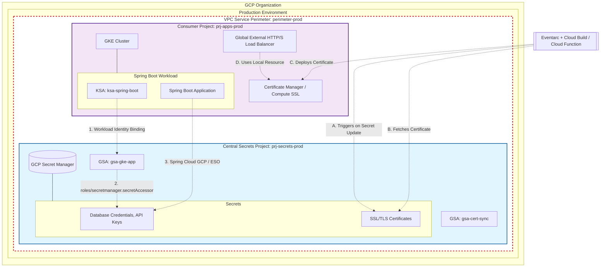

# Enterprise GCP Centralized Secrets Architecture

## 1. Executive Summary

In enterprise Google Cloud Platform (GCP) environments, a **Hub-and-Spoke Secret Management architecture** is the recommended best practice. This pattern isolates sensitive data into dedicated "Central Secret Projects" (separated by environment, e.g., Production and Non-Production) and grants scoped read access to consuming workloads in satellite or "app" projects.

This document outlines the architecture, IAM (Identity and Access Management) model, and exact workflows for two specific cross-project consumption scenarios:
1. **GKE Spring Boot Applications** retrieving application secrets.
2. **GCP Load Balancers** retrieving SSL/TLS certificates.

---

## 2. Architecture Diagram



---

## 3. Scenario A: GKE Spring Boot Application Consuming Secrets

To securely fetch secrets from `prj-secrets-prod` into a Spring Boot application running in `prj-apps-prod`, we use **Workload Identity Federation for GKE**. This completely eliminates the need to export service account keys.

### 3.1 Mechanism & Best Practices
There are two production-grade ways to integrate:
1. **Native Integration (Spring Cloud GCP)**: The application code directly calls the Secret Manager API.
2. **External Secrets Operator (ESO)**: A Kubernetes operator that fetches the secret and synchronizes it into a native Kubernetes `Secret` resource. This keeps the application cloud-agnostic.

*Recommended: External Secrets Operator (ESO) for better separation of concerns and cloud agnosticism.*

### 3.2 Step-by-Step Implementation (ESO Approach)

1. **Create the Google Service Account (GSA)** in the Central Project:
   ```bash
   gcloud iam service-accounts create gsa-gke-app \
       --project=prj-secrets-prod
   ```
2. **Grant Secret Accessor Role** to the GSA on the specific secret (Principle of Least Privilege):
   ```bash
   gcloud secrets add-iam-policy-binding app-db-password \
       --project=prj-secrets-prod \
       --member="serviceAccount:gsa-gke-app@prj-secrets-prod.iam.gserviceaccount.com" \
       --role="roles/secretmanager.secretAccessor"
   ```
3. **Configure Workload Identity** in the App Project:
   ```bash
   # Create KSA in the app project's GKE cluster
   kubectl create serviceaccount ksa-spring-boot --namespace my-app

   # Bind KSA to GSA
   gcloud iam service-accounts add-iam-policy-binding gsa-gke-app@prj-secrets-prod.iam.gserviceaccount.com \
       --role roles/iam.workloadIdentityUser \
       --member "serviceAccount:prj-apps-prod.svc.id.goog[my-app/ksa-spring-boot]"
       
   # Annotate KSA
   kubectl annotate serviceaccount ksa-spring-boot \
       --namespace my-app \
       iam.gke.io/gcp-service-account=gsa-gke-app@prj-secrets-prod.iam.gserviceaccount.com
   ```
4. **Configure ESO `SecretStore`**:
   Deploy a `ClusterSecretStore` in GKE configured to use the Workload Identity KSA to authenticate to GCP and fetch the payload from `prj-secrets-prod`.

---

## 4. Scenario B: GCP Load Balancer Consuming SSL Certificates

Unlike compute resources, GCP Load Balancers **do not natively pull SSL certificates directly from Secret Manager** across projects at runtime. The Load Balancer expects the certificate to exist as a native `Compute Engine SSL Certificate` or a `Certificate Manager` resource within the *same* project as the Load Balancer (or attached via cross-project Certificate Maps).

### 4.1 Mechanism & Best Practices
If the source of truth for the raw certificate (PEM/Key) is the Central Secret Manager, you must implement an **Event-Driven Automation pattern** to propagate it.

### 4.2 Step-by-Step Implementation

1. **Central Storage**: The Wildcard or custom SSL Certificate and Private Key are stored as a secret in `prj-secrets-prod` (e.g., `wildcard-ssl-cert`).
2. **Automation Trigger**: 
   - Deploy an **Eventarc** trigger in `prj-secrets-prod` that listens for the `google.cloud.secretmanager.v1.SecretManagerService.AddSecretVersion` event.
   - Route this event to a **Cloud Function** or **Cloud Build** pipeline.
3. **Propagation Logic (The Script/Pipeline)**:
   - The automation service runs under a dedicated GSA (`gsa-cert-sync`).
   - It fetches the new certificate payload from Secret Manager.
   - It executes a command to create/update the Certificate Manager resource in the consumer project:
     ```bash
     gcloud certificate-manager certificates create my-app-cert \
         --project=prj-apps-prod \
         --certificate-file=cert.pem \
         --private-key-file=key.pem
     ```
4. **Load Balancer Attachment**:
   - The Load Balancer in `prj-apps-prod` is configured to use the `my-app-cert` from Certificate Manager. Once the automation updates the certificate, the Load Balancer automatically serves the new cert without downtime.

---

## 5. VPC Service Controls (VPC-SC) Integration

In a highly secure environment, both the Central Secrets Project and the Consumer Projects must be protected by **VPC Service Controls**. This prevents data exfiltration, ensuring that secrets cannot be read from outside the corporate network, even if IAM credentials are compromised.

### Recommended Configuration: Single Prod Perimeter
The simplest and most secure approach is to place **both `prj-secrets-prod` and `prj-apps-prod` within the same VPC Service Perimeter**.
- **Internal Access**: Services within the same perimeter can communicate freely (subject to IAM permissions). GKE in `prj-apps-prod` can seamlessly call Secret Manager in `prj-secrets-prod`.
- **Protected APIs**: Ensure `secretmanager.googleapis.com` and `container.googleapis.com` are added to the list of restricted services for the perimeter.

### Alternative Configuration: Separate Perimeters (Ingress/Egress Rules)
If the Central Secrets Project is in its own isolated perimeter (`perimeter-core-sec`) and the App Project is in another (`perimeter-apps`), you must configure **Ingress and Egress rules**:
1. **Egress Rule on `perimeter-apps`**: Allow the Workload Identity GSA (`gsa-gke-app`) to make egress API calls to the `secretmanager.googleapis.com` service in `prj-secrets-prod`.
2. **Ingress Rule on `perimeter-core-sec`**: Allow ingress from `prj-apps-prod` specifically for the `gsa-gke-app` identity to access Secret Manager methods (e.g., `SecretManagerService.AccessSecretVersion`).

---

## 6. Additional Security & Governance Posture

To ensure this architecture meets strict Enterprise / FinOps / SecOps compliance:

1. **Customer-Managed Encryption Keys (CMEK)**:
   - All secrets in `prj-secrets-prod` MUST be encrypted using Cloud KMS keys.
   - The KMS keys should reside in a separate dedicated Key Management project (`prj-kms-prod`).
2. **Audit Logging**:
   - Enable **Data Access Audit Logs** for Secret Manager API.
   - Forward logs to a central SIEM (e.g., Splunk / Chronicle) to monitor exactly *which* KSA/GSA accessed *which* secret at *what* time.
3. **Secret Rotation**:
   - Utilize Secret Manager's built-in rotation schedules linked to Cloud Functions to automatically rotate database credentials and API keys on a 30/60/90 day schedule.
