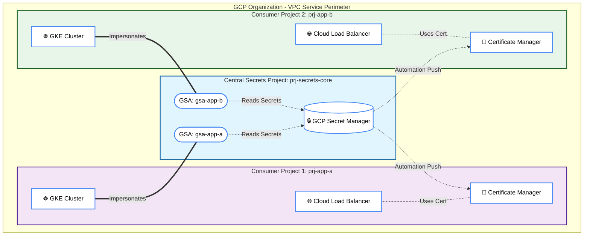
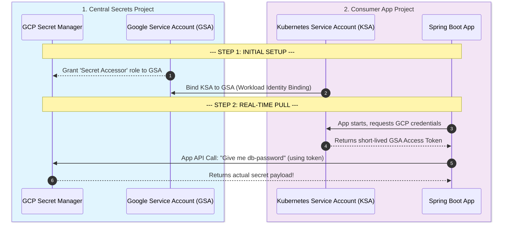
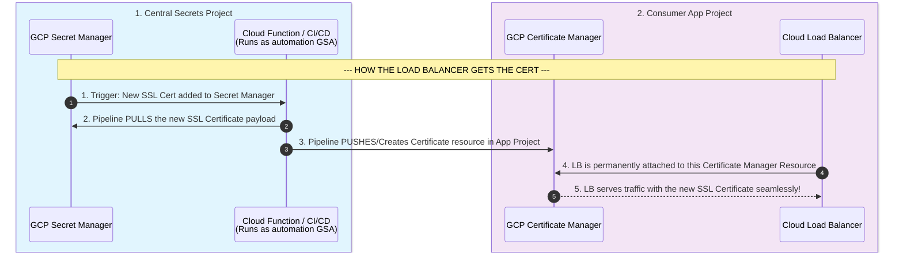
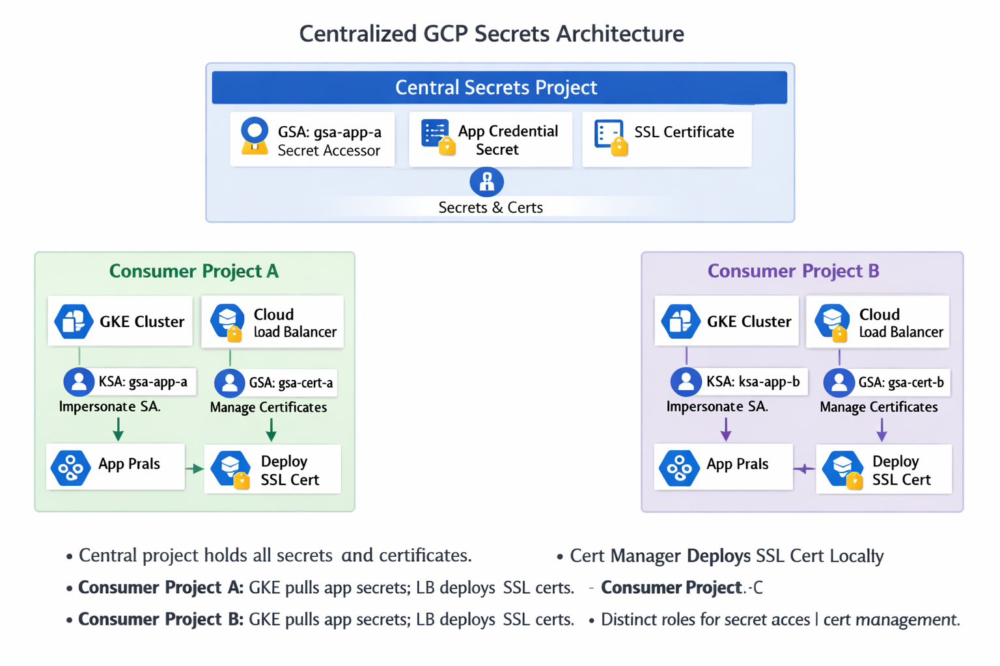

# 📘 Enterprise Centralized Secrets Architecture in GCP

## 1. Overview

This document describes the **Hub‑and‑Spoke secrets management model** in Google Cloud Platform (GCP).  
- **Central Project (`prj-secrets-core`)** hosts all sensitive assets (secrets, SSL certificates).  
- **Consumer Projects (`prj-app-a`, `prj-app-b`)** run workloads (GKE clusters, Load Balancers) that consume secrets securely.  
- **Workload Identity Federation** and **Secret Manager add‑on for GKE** ensure secure, keyless access.  
- **Automation pipelines** handle cross‑project certificate distribution for Load Balancers.

This architecture enforces **least privilege**, **central governance**, and **auditable flows**.

---

## 2. Centralized Secret Manager Design

- **Single Source of Truth**: All secrets (DB passwords, API keys, TLS certs) are stored in **Secret Manager** in the central project.  
- **Google Service Accounts (GSAs)**: Each consumer project has a dedicated GSA (`gsa-app-a`, `gsa-app-b`) with `roles/secretmanager.secretAccessor`.  
- **IAM Boundaries**: GSAs are scoped only to the secrets they need, preventing lateral access.  
- **Audit Logging**: Access logs are centralized for compliance.

---

## 3. GKE Workload Identity Integration

### Workflow
1. **Create GSA** in central project with `Secret Accessor` role.  
2. **Create KSA** in consumer project (e.g., `ksa-app-a`).  
3. **Bind KSA → GSA** using IAM `roles/iam.workloadIdentityUser`.  
4. **Secret Manager add‑on** syncs secrets into Kubernetes Secrets automatically.  
5. **Applications (Spring Boot, etc.)** consume secrets via environment variables or mounted volumes.

> 📖 **Official Best Practice Documentation**: [Synchronize secrets to Kubernetes Secrets](https://docs.cloud.google.com/secret-manager/docs/sync-k8-secrets)

### Benefits
- No JSON key files.  
- Short‑lived tokens reduce risk.  
- Fully Google‑managed sync (no third‑party operators).  
- Seamless rotation: updated secrets propagate automatically.

---

## 4. SSL Certificate Distribution for Load Balancers

### Challenge
Cloud Load Balancers require certificates in **Certificate Manager** of the same project. They cannot directly read cross‑project secrets natively.

### Solution: Automation Pull Pattern
- **Trigger**: Secret Manager update (new/rotated certificate).  
- **Pipeline/Cloud Function** (running as automation GSA) pulls the certificate.  
- **Push**: Certificate is created in the consumer project’s Certificate Manager.  
- **Load Balancer** is permanently bound to that certificate resource.  
- **Result**: Traffic is served with the updated certificate seamlessly.

### Security Controls
- Automation GSA has **read‑only** access to central secrets and **write‑only** access to consumer Certificate Manager.  
- CI/CD pipelines run inside VPC Service Perimeter for data exfiltration protection.  
- Audit logs track every certificate push.

---

## 5. Governance & Compliance

- **IAM Separation**: Developers in consumer projects cannot access central secrets directly.  
- **VPC Service Controls (VPC-SC)**: Both the Central and Consumer projects are placed inside a VPC-SC perimeter (or bridged via Ingress/Egress rules). This prevents data exfiltration, ensuring that secrets cannot be read from outside the corporate network, even if IAM credentials are leaked.
- **Automated Secret Rotation Policy**: 
  - **Schedule**: Secrets (like DB passwords) are configured with a native rotation schedule (e.g., every 30 days) in Secret Manager.
  - **Execution**: When triggered, Secret Manager invokes an attached **Cloud Function**. This function executes the custom logic to generate a new password, update the backend database, and save the new version in Secret Manager.
  - **Propagation**: Thanks to the GKE Secret Manager add-on, downstream consumers automatically receive the new version without any manual intervention or application restarts.
- **Monitoring**: Cloud Audit Logs + Cloud Monitoring alerts for unauthorized access attempts.  
- **Scalability**: Additional consumer projects can be onboarded by creating new GSAs and bindings without changing central architecture.  
- **Disaster Recovery**: Central project backups ensure secrets are recoverable independently of consumer workloads.

---

## 6. Operational Runbook

- **Onboarding New App Project**  
  1. Create GSA in central project.  
  2. Create KSA in app project.  
  3. Bind KSA → GSA.  
  4. Configure Secret Manager add‑on.  
  5. Validate access with test secret.  

- **Rotating Secrets**  
  1. Update secret in central project.  
  2. Verify sync to GKE via add‑on.  
  3. Confirm automation pipeline pushes updated certs to Certificate Manager.  
  4. Monitor LB serving new cert.  

- **Incident Response**  
  - Revoke GSA IAM bindings immediately if compromise suspected.  
  - Rotate affected secrets centrally.  
  - Audit logs to identify scope of exposure.

---

## 7. Key Advantages

- 🔒 **Security**: No static keys, short‑lived tokens, centralized governance.  
- ⚡ **Automation**: Secrets and certs flow automatically to workloads.  
- 📈 **Scalability**: Easily extend to new projects.  
- 📜 **Compliance**: Centralized audit trail for regulators.  
- 🛠️ **Operational Simplicity**: One hub, many spokes, consistent patterns.

---

## 8. Quick Reference Checklist (One-Page Runbook)

| Task | Steps | Validator / Owner |
|------|-------|-------------------|
| **Deploy App Secret** | 1. Create Secret in `prj-secrets-core`   2. Add IAM `secretAccessor` for app's GSA   3. Verify KSA/GSA binding in `prj-app-*`   4. Deploy `SecretProviderClass` in GKE | Security / DevOps |
| **Rotate DB Password** | 1. Trigger rotation via Cloud Function / Manual update in `prj-secrets-core`   2. Verify Secret Manager Add-on successfully syncs to K8s Secret | DBA / DevOps |
| **Deploy/Rotate SSL Cert** | 1. Upload new `.pem` / `.key` to Secret Manager   2. Ensure Pipeline fires successfully   3. Verify Certificate Manager in `prj-app-*` reflects new cert   4. Ensure LB is serving new cert | SecOps / DevOps |
| **Onboard New Project** | 1. Provision `prj-app-c` inside VPC-SC   2. Create `gsa-app-c` in Central Project   3. Stand up GKE and configure Workload Identity | Platform Team |

---

## 9. Visual Architecture Reference

